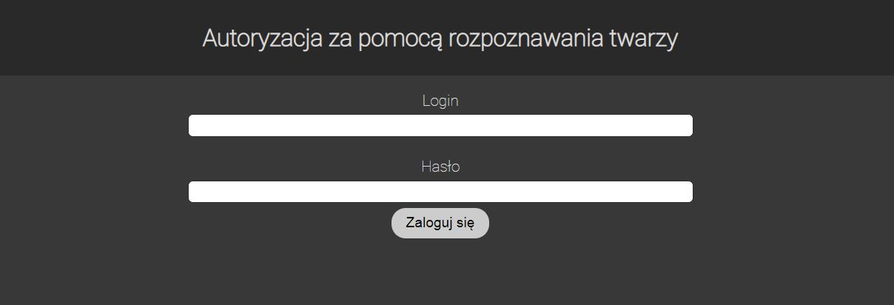
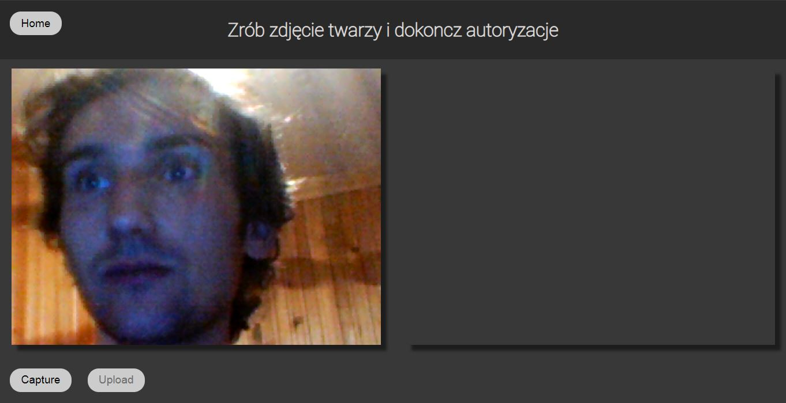
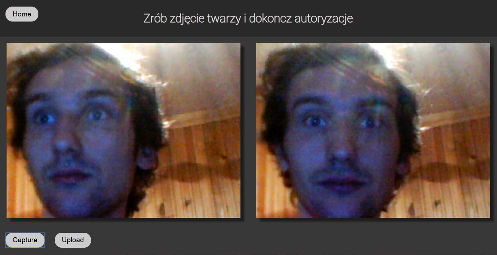
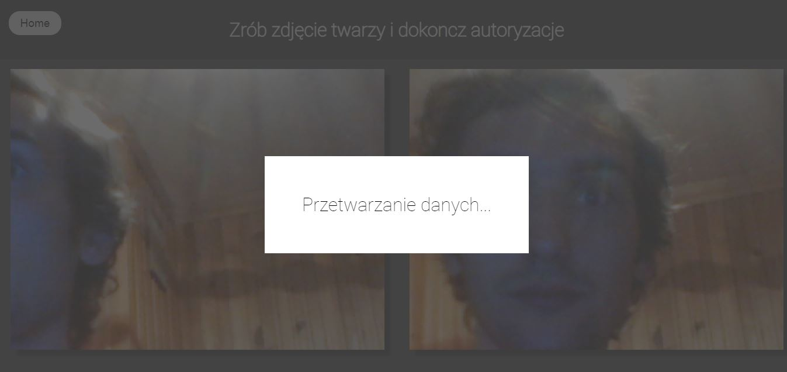
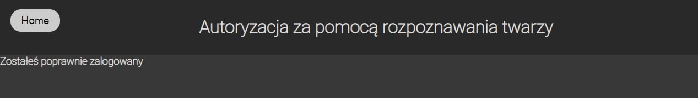
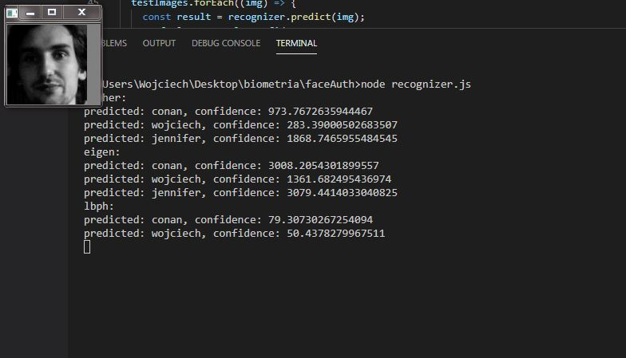

# faceAuth

Dwu stopniowa autoryzacja za pomocą hasła i rozpoznawania twarzy

## Opis

Projekt wykorzystuje biometryczne możliwości do rozpoznawnia twarzy. Program zawiera 
dwu stopniową autoryzację, na początku sprawdzany jest zwykły login i hasło, następnie 
sprawdzane jest za pomocą zdjęcia z kamerki internetowej znajduje się w bazie i pasuje do użytkownika
Program wykorzystuje zdjęcie przechowane w swojej bazie i na tej podstawie ocenia czy ma 
doczynienia z daną osobą. Taka autoryzacja pozwala na zwiększenie bezpieczeństwa podczas logowania.

Do rozpoznawania twarzy został wykorzystany algorytm Local binary patterns histograms (LBPH),
daje on nieco lepsze rezultaty niż algorytm Fisherfaces. Algorytm Eigenfaces miał problemy
z poprawnym rozponawaniem, źle sobie radzi z niedoświetlonymi zdjęciami.


## Wymagania i instalacja

Potrzebny jest zainstalowany OpenCV na swoim systemie oraz Node.js przynajmniej v12.6.4
Następnie należy doinstalować resztę modułów za pomocą poniższej komendy

```
npm install

```

## Jak uruchomić 1

Poniższa linia pozwala uruchomić serwer

```
node server.js
```

Aplikacja dostępna jest pod adresem http://localhost:8080/.
W obecnej wersji jest tylko jeden użytkownik login: wojciech / hasło: wojtek
Należy pozwolić przeglądarce na wykorzystanie kamery internetowej

## Jak to działa 1







## Jak uruchomić 2

Poniższa linia pozwala uruchomić rozponanie testowych twarzy

```
node regonizer.js
```

Aplikacja na podstawie bazy ocenia testowe zdjęcia i przypisuje je do osób.
Sprawdza ona podobieństwo za pomocą 3 algorytmów: Eigenfaces, Fisherfaces 
oraz Local binary patterns histograms (LBPH)

## Jak to działa 2


